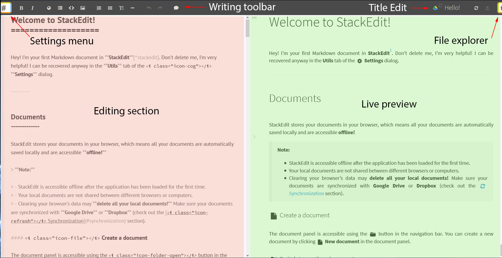
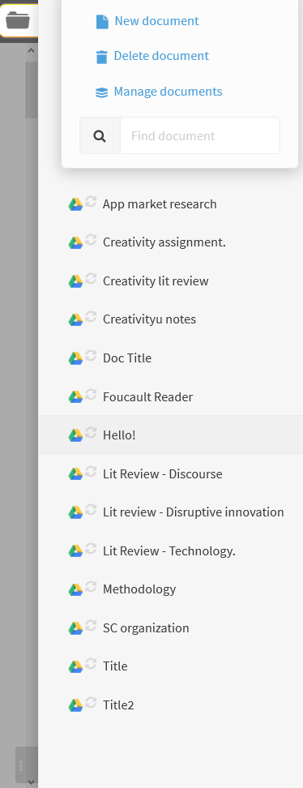
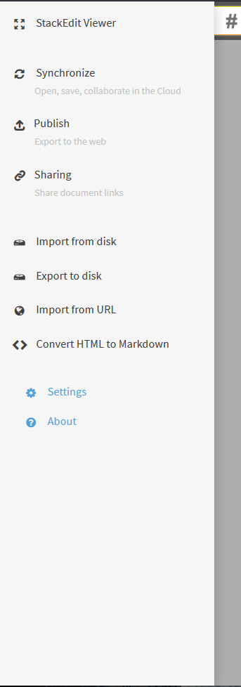
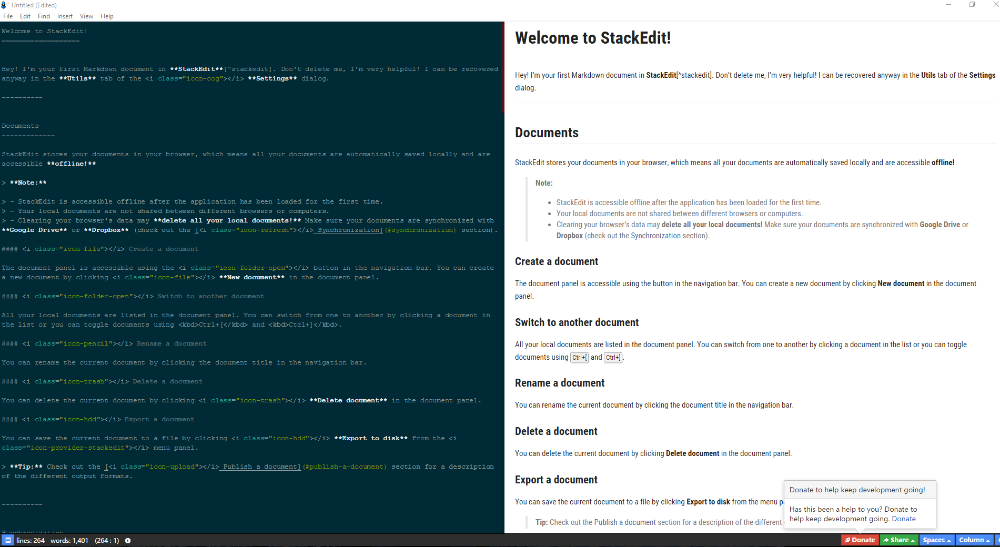
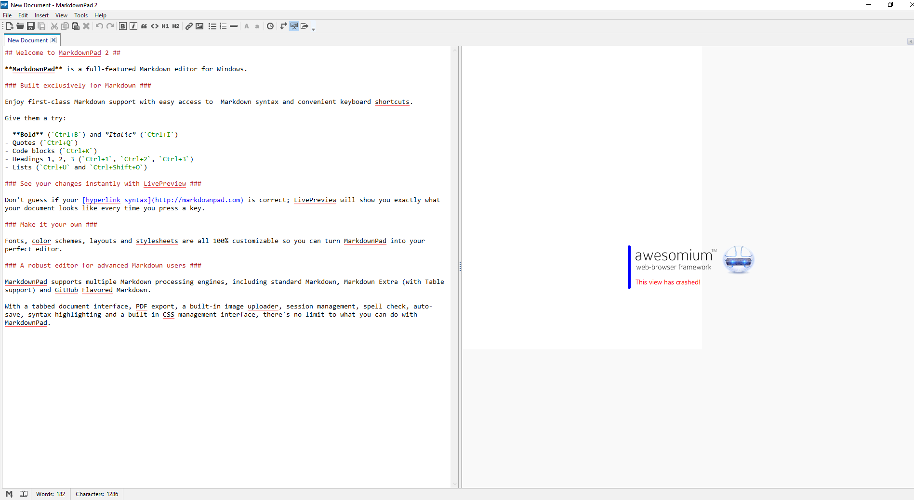

# Peer UI Analysis

## StackEdit

Being SaaS based it's setup on browser. It is setup as a Web App, which means that an internet connection is needed. Once the application is running interenet connection can be disabled as it's a one page app and all functionality is loaded at the start. Files are saved in localStorage object which means that cleaning temporary files will delete the files stored. This problem is solved by having synchronization functionality with dropbox and google drive. This will affect the design of the UI.

### Main editor view 

The main editor is representing of the vast majority of the apps I have seen with two sides, one with and editor and one with the live preview. The interface allows for hiding of almost anything allowing to hide the toolbar at the top and the live preview in order to leave only the editor present.

The toolbar is not intrusive and miinimalistic, showing different html insertions like images, tables lists and code blocks. It also has undo and redo options which allow for easy working with it without having to know shortcuts like "ctrl - z" or "ctrl - y". Even though it shows things that only developers would use the UI is flexible enough to be used by enyone and the ability to show the toolbar or not allows for  different levels of commodity and efficiency to be achieved, pleasing a wider audience outside of the developer community.

The title editing system seems a bit unintuitive. Having to rename the file through there is something that no other applications I have seen do, which takes time to get muscle memory used to in order to quickly change the title. Normally files are names when saving and they take the first line as default name. This change makes it counterintuitive when paired wiotht he mainstream usage of naming files.

The editor view has some strengths and weaknesses when it comes to syntax highlighting. It changes the the font size and the boldens and makes italic the content that will become bolden or italic in the preview, but this changes don't always match the formatting that is received in the preview mode. The markdown keywords are highlighted in a different color than the rest of the code making it easy to highlight from the rest of the content.

### File broswer

The integrated file manager is easy to use and intuitive. When creating a new file the app directs you to the editor and opens the file. Deleting files do not delete them from the google drive which makes it tedious to delete the files completely, having to go to two places in order to do so. This is because the file only erases the file object in the localStorage, but doesn't link with Google Drive or DropBox. As it is a browser SaaS it's forced to have it's own browser manager and can't use the windows file explorer which means that it can't creat e folders and doesn't have as much flexibiility as normal file browsers. Also the syncing with cloud hosting services doesn't allow for good file management either putting all files in one same folder.

### Settings menu

The settings menu seems unnecessary, in the way that it is occupying much more space than it should, almost as if it could be embedded on the file manager as all the options available in it are related to file management and editing. Apart from that the menu seems clean and very well explained.  It is intersting how some of the actions which may not be described with just a title have a subtitle explaining a bit further what they are.

## Haroopad

The ability to change from one theme to another for the editor (left) is extremely good, as it allows users to use a theme that they may be used to and recognize (on image: solarized dark). However the syntax highlighting seems a bit weak in some points. First of all there is no difference in font size for headings and there is no highlighting of Markdown keywords.

The word counter at the bottom seems more handy for people within a work environment outside of actual web development. The fact that it's present constantly reminds of major rich text editors like Word or LibreOffice Writer.

There are two toolbars, one at the bottom and one at the top. The bottom one has a set of option to toggle UI elements. These are a syntax cheatsheet sidebar, toggling fullscreen and showing the markdown outline in the preview. There is also an option menu to choose how many columns the preview should have and how many spaces the editor should set on tab press.
Interestingly enough, there is another menu related to UI visualization at the top with options to change theme, font size and repeating the options available at the bottom, making onem of the menus become obsolete. I believe that highlighting UI customization should be highlighted so I believe the bottom menu is a good idea.

## Markdown Pad

The live preview doesn't work on W10 which means that I cannot actually see how the live preview works. 
The toolbar at the top seems quite simple to use and explains very easily what each thing does, while it doesn't every single thing that can be used it has the entities that may be used the most including the code block insert and other inserts specific to developers which may be useless for any other ausience. There is no customization for this toolbar which may render it useless for people that are need other type of shortcuts. The toolbar is very similar to the one that could be see in Word and the UI aesthetic reminds of windows 7 era Interfaces which is quite easy to use.

The menus at the top are the menus that could be easily seen in any other text editor with the file, edit and insert menus that allow for exporting in HTML and PDF as well as inserting all different types of markdown keywords on the document.

The syntaxhighlighting is quite complete and while it doesn't have differences in font-size for header it does a good job in differentiating different entities with very different colors. Even then it wouldn't be too much to put even a different color for the actual markdown syntax.

The editor also has autocorrect showcase which is somethin that I haven't seen in any other prominent markdown editor, which I believe is quite important when writing large amounts of content.

